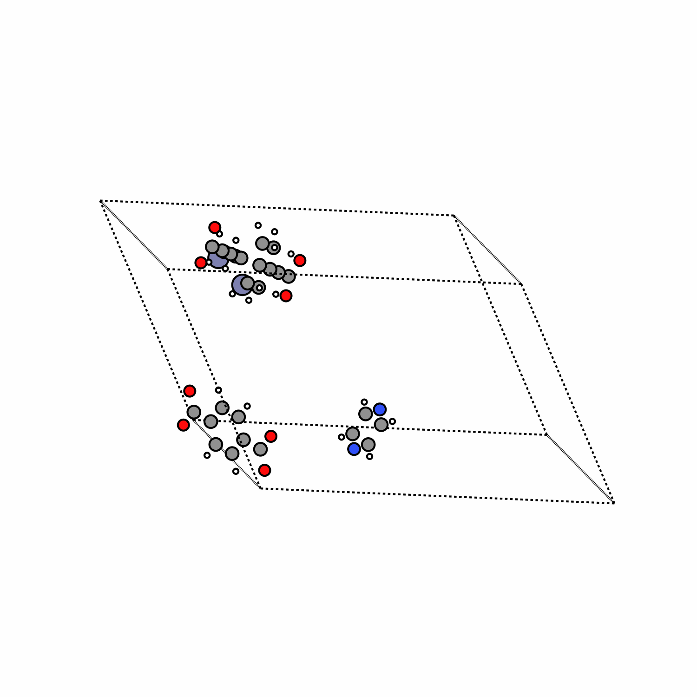
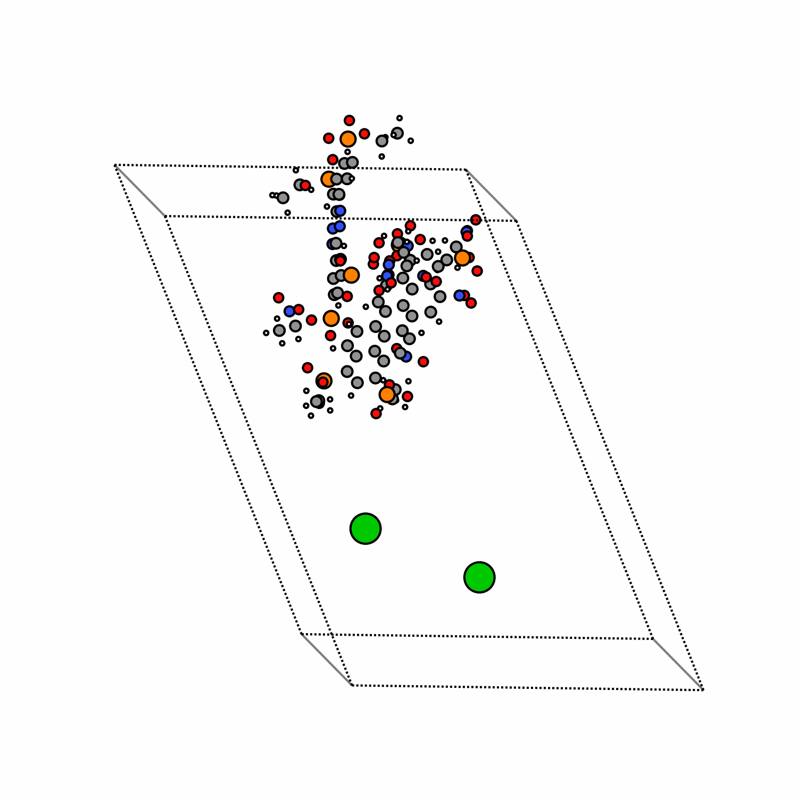
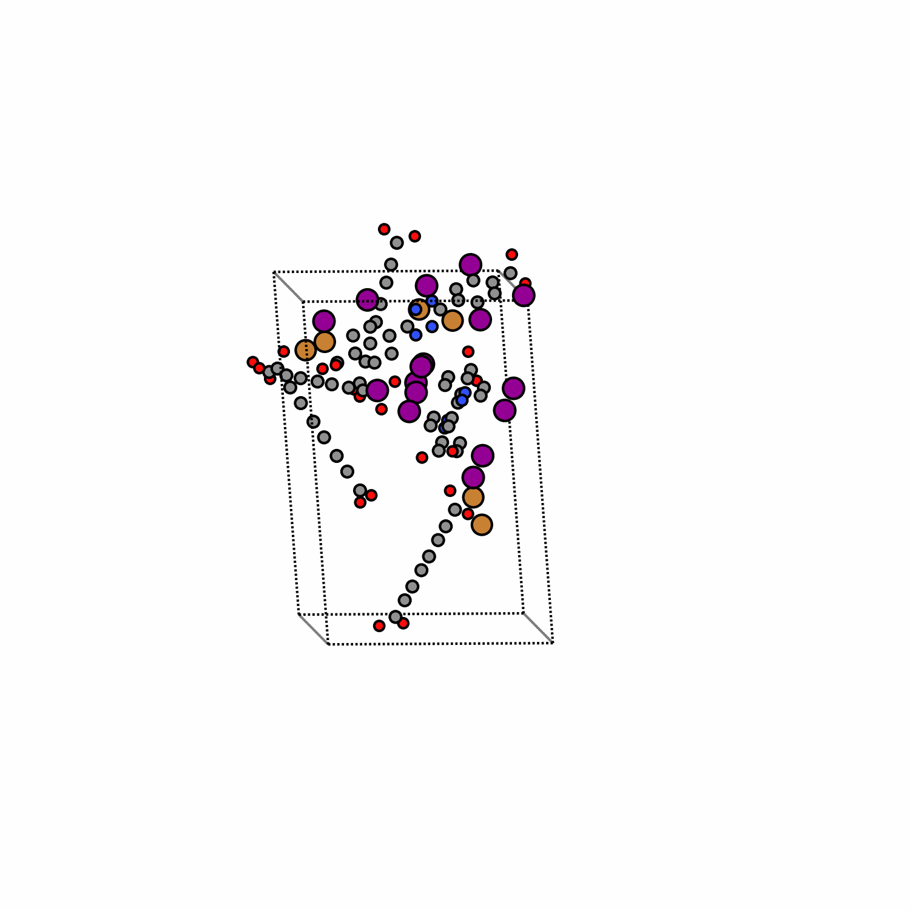

# MOFFlow: Flow Matching for Structure Prediction of Metal-Organic Frameworks

[](https://arxiv.org/abs/2410.17270)

<p align="center">
  
  
  
</p>

## Table of Contents
- [Installation](#installation)
  - [Clone repository](#clone-repository)
  - [Setup environment](#setup-environment)
  - [Setup .env file](#setup-env-file)
- [Dataset & checkpoints](#dataset--checkpoints)
- [Training](#training)
  - [Training from scratch](#training-from-scratch)
  - [Continue training from checkpoint](#continue-training-from-checkpoint)
- [Evaluation](#evaluation)
  - [RMSD](#rmsd)
  - [Property computation (with zeo++)](#property-computation-with-zeo)
- [📚 Citation](#-citation)

## 📌 Note
The following guidelines apply to the **`batch` version** of MOFFlow, as introduced in **Appendix D** of our paper. This version is a refactored implementation designed for **faster training**.

The experiments in the main paper were conducted using the original **`timebatch`** version, which you can access with:

```bash
git checkout timebatch
```

However, we recommend using the `batch` version, as it achieves convergence significantly faster — 1–2 days compared to about 1 week with timebatch.

## Installation

### Clone repository
```bash
git clone https://github.com/nayoung10/MOFFlow.git # clone repo
cd MOFFlow
```

### Setup environment

```bash
mamba env create -f env.yml
mamba activate mofflow
pip install git+https://github.com/microsoft/MOFDiff.git
pip install -e .
```

For **property computation**, please install `zeo++` from [here](https://www.zeoplusplus.org/download.html). 

### Setup ```.env``` file

Create ```.env``` file with following entries. 
```bash
export PROJECT_ROOT=<root_dir>
export ZEO_PATH=<path_to_network_binary> # for property computation
```

## Dataset & checkpoints

You can download the dataset and checkpoints from [zenodo](https://zenodo.org/records/15187230).
Place the dataset files under `data/mof/cif_200_inf`. 

## Training

### Training from scratch

The following code starts training from scratch. All paths/directory information are in ```configs/paths.yaml```; modify as needed. 

```bash
python experiments/train.py experiment.wandb.name=<expname>
```

### Continue training from checkpoint

To continue training from ```<ckpt_path>``` in experiment ```<expname>```

```bash
python experiments/train.py \
    experiment.wandb.name=<expname> \
    experiment.warm_start=<ckpt_path> \
    +experiment.wandb.id=<run_id> \ # wandb run ID (optional)
    +experiment.wandb.resume=must # resume wandb run
```

## Evaluation 

### RMSD

To evaluate structure prediction accuracy via RMSD, run the following command.

```bash
# Adjust settings as needed
export MKL_NUM_THREADS=1 # adjust as needed
export NUMEXPR_NUM_THREADS=1
export OMP_NUM_THREADS=1

python experiments/evaluate.py
    --save_pt <path/to/predict.pt> \
    --num_samples <k> \ # inferred from data shape if not provided; use if k < k_generated
    --num_cpus <ncpu> \ # default to 48
```

### Property computation (with `zeo++`)

To compute structural properties (e.g., surface area, pore volume), run:

```bash
# Adjust settings as needed
export MKL_NUM_THREADS=1
export NUMEXPR_NUM_THREADS=1
export OMP_NUM_THREADS=1

python evaluation/property.py --cif_dir <inference_dir> --ncpu <num_cpus>
```

## 📚 Citation

If you find MOFFlow useful in your work, please consider citing the following:

```bibtex
@inproceedings{kim2024mofflow,
  title={MOFFlow: Flow Matching for Structure Prediction of Metal-Organic Frameworks},
  author={Kim, Nayoung and Kim, Seongsu and Kim, Minsu and Park, Jinkyoo and Ahn, Sungsoo},
  booktitle={The Thirteenth International Conference on Learning Representations},
  year={2025},
  url={https://openreview.net/forum?id=dNT3abOsLo}
}
```

Our data preprocessing pipeline and benchmark data are adapted from the following works. Please consider citing them as well:

```bibtex
@inproceedings{
fu2024mofdiff,
title={{MOFD}iff: Coarse-grained Diffusion for Metal-Organic Framework Design},
author={Xiang Fu and Tian Xie and Andrew Scott Rosen and Tommi S. Jaakkola and Jake Allen Smith},
booktitle={The Twelfth International Conference on Learning Representations},
year={2024},
url={https://openreview.net/forum?id=0VBsoluxR2}
}
```

```bibtex
@article{boyd2019data,
  title={Data-driven design of metal--organic frameworks for wet flue gas CO2 capture},
  author={Boyd, Peter G and Chidambaram, Arunraj and Garc{\'\i}a-D{\'\i}ez, Enrique and Ireland, Christopher P and Daff, Thomas D and Bounds, Richard and G{\l}adysiak, Andrzej and Schouwink, Pascal and Moosavi, Seyed Mohamad and Maroto-Valer, M Mercedes and others},
  journal={Nature},
  volume={576},
  number={7786},
  pages={253--256},
  year={2019},
  publisher={Nature Publishing Group UK London}
}
``` 
